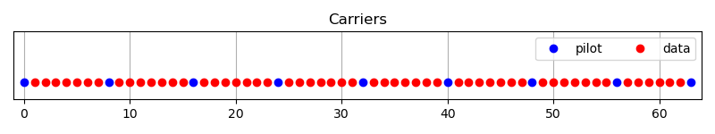
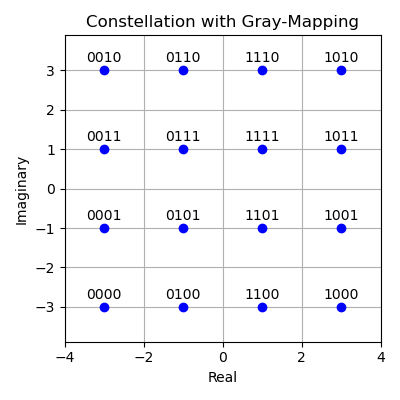
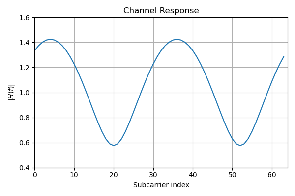
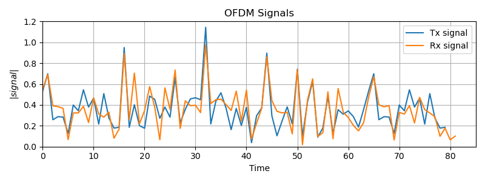
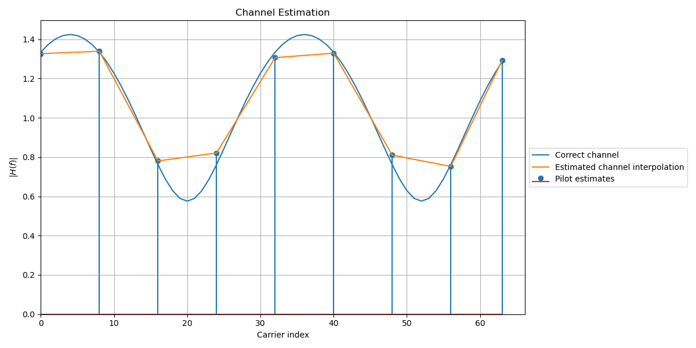
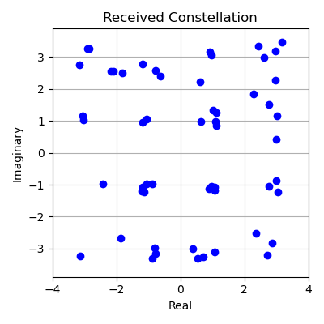
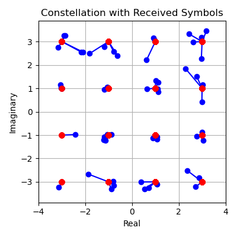

# 16-QAM OFDM Wireless Communication Simulation

This project simulates a **16-QAM (Quadrature Amplitude Modulation)** based **OFDM (Orthogonal Frequency-Division Multiplexing)** communication system. It models all essential stages of the physical layer, including modulation, channel effects, equalization, and demodulation, complete with detailed visualizations.

## 📁 Folder Structure

```
WirelessComm/
├── 16qam_ofdm.py                            # Main simulation for 16-QAM OFDM
├── 64qam_ofdm.py                            # Main simulation for 64-QAM OFDM
├── 256qam_ofdm.py                           # Main simulation for 256-QAM OFDM
├── 16qam_ofdm_image.py                      # Simulation of 16-QAM OFDM transferring an image
├── 16qam_ofdm_image_varying_cyclic_prefix.py  # Simulation of 16-QAM OFDM with varying cyclic prefix (CP)
├── 16qam_ofdm_image_varying_snr.py          # Simulation of 16-QAM OFDM with varying SNR
├── 16qam_ofdm_image_varying_subCarriers.py  # Simulation of 16-QAM OFDM with varying subcarriers (SC)
├── plot.py                                  # Utility functions for all visualizations
├── *.png                                    # Generated images from simulations
```

## 🚀 How to Run the Project

### ▶️ Run Individual Simulation

To execute the 16-QAM OFDM simulation:

```bash
python 16qam_ofdm.py
```

This script will generate several `.png` plots and print the bit error rate at the end.

To execute other QAM OFDM simulations:

```bash
python 64qam_ofdm.py
python 256qam_ofdm.py
python 16qam_ofdm_image.py
python 16qam_ofdm_image_varying_snr.py
python 16qam_ofdm_image_varying_cyclic_prefix.py
python 16qam_ofdm_image_varying_subCarriers.py
```

These script will also generate several `.png` plots and print out many information.

## 📦 Requirements

Make sure the following Python packages are installed:

```bash
pip install numpy matplotlib scipy
```

## 🧠 Features

- Gray-mapped 16-QAM modulation
- OFDM with pilot-based channel estimation
- Static multipath fading channel
- Cyclic prefix handling
- FFT-based domain transformation
- Equalization and demodulation
- Bit error rate (BER) computation
- Step-by-step visualization

## 🖼 Output Visualizations

- `16qam_carriers.png`: Subcarrier allocation map
- `16qam_constellation_map.png`: Transmit constellation
- `16qam_channel_response.png`: Channel frequency response
- `16qam_signals.png`: Time-domain transmitted and received signal
- `16qam_channel_estimation.png`: Estimated vs actual channel
- `16qam_received_constellation.png`: Received constellation
- `16qam_constellation_decoding.png`: Decoded constellation points

### 📷 Example Visual Outputs

**1. Subcarrier Allocation Map**


**2. Transmit Constellation**


**3. Channel Frequency Response**


**4. Time-domain Signal Transmission**


**5. Channel Estimation**


**6. Received Constellation**


**7. Decoded Constellation Points**


## 📚 Learning Outcomes

This project helps understand:

- The complete transmission and reception chain of an OFDM system
- The impact of channel fading and noise
- Channel estimation and equalization techniques
- BER analysis for communication reliability
